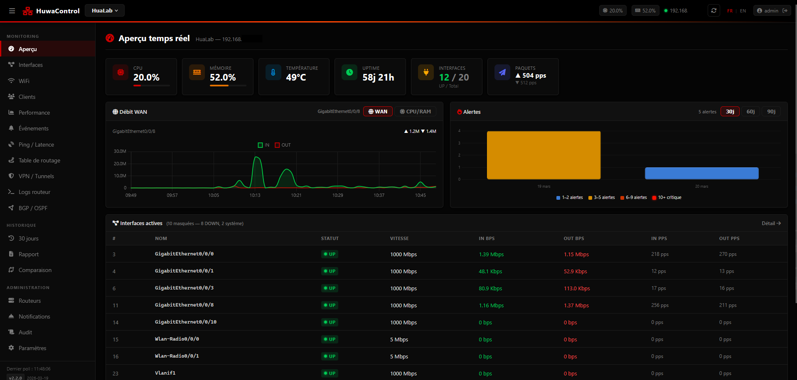
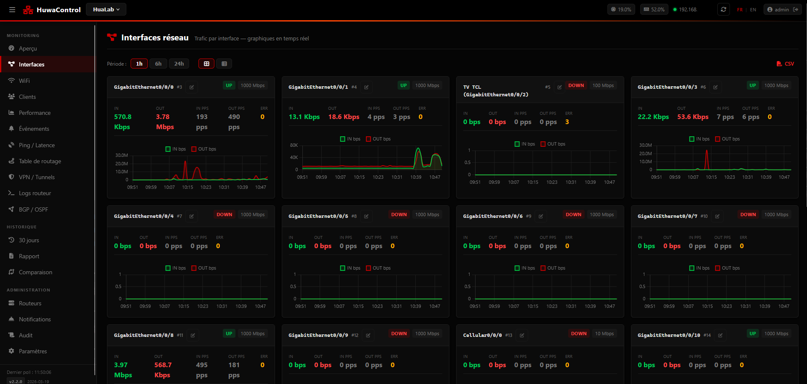
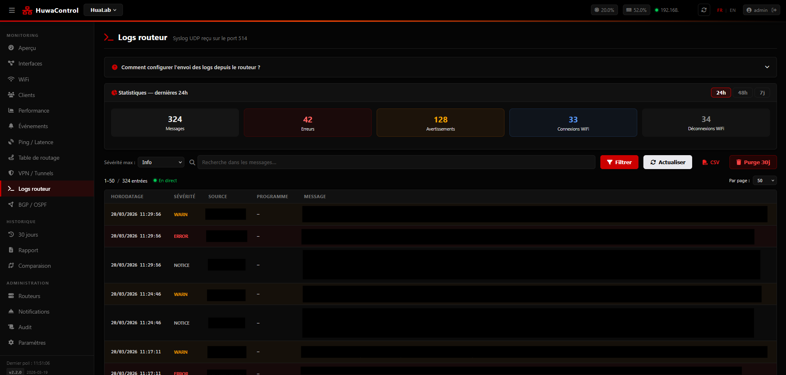

<p align="center">
  
  
  
  
  
</p>

<h1 align="center">HuwaControl</h1>
<p align="center">
  Network monitoring dashboard for <strong>Huawei AR Series</strong> routers<br>
  SNMPv3 · Syslog · Ping SLA · Discord/Telegram alerts · Dark web UI
</p>

---

## Screenshots

<p align="center">
  
  <br><em>Dashboard — CPU, RAM, temperature, uptime, interface traffic in real time</em>
</p>

<p align="center">
  
  <br><em>Interfaces — Status, traffic graphs, custom aliases</em>
</p>

<p align="center">
  
  <br><em>Syslog — UDP receiver, filtering, pagination, 24h statistics</em>
</p>

---

## Features

| Category | Details |
|----------|---------|
| **Dashboard** | CPU, RAM, temperature, uptime, interface traffic in real time |
| **Interfaces** | Status, bps/pps traffic, history graphs, custom aliases |
| **Syslog** | UDP receiver (RFC 3164/5424), filtering, pagination, statistics |
| **Ping / SLA** | ICMP probes, SLA %, average RTT, history |
| **SNMP Traps** | Built-in receiver (SNMPv1/v2c/v3) |
| **BGP / OSPF** | Neighbor state, uptime, prefixes |
| **Clients** | Live ARP table, MAC history, DHCP leases |
| **Alerts** | Discord webhooks, Telegram bots, SMTP email |
| **Reports** | Automatic daily report (Discord + Telegram) |
| **Multi-router** | Manage multiple routers from a single dashboard |

## Deploy (Portainer / Dockge / any Docker host)

Copy and paste `docker-compose.yml` — no other files needed.

```bash
# Or from the command line:
docker compose up -d
```

Access: **http://localhost:8080**
First login → setup wizard.

## Router configuration

**SNMP (required)**

SNMPv3 is recommended for security. You can configure it directly from the **router panel** in HuwaControl after the initial setup.

```
snmp-agent
snmp-agent usm-user v3 <USERNAME>
snmp-agent usm-user v3 <USERNAME> authentication-mode sha <AUTH_PASSWORD>
snmp-agent usm-user v3 <USERNAME> privacy-mode aes128 <PRIV_PASSWORD>
snmp-agent sys-info version v3
```

**Syslog (optional)**

Syslog can be configured directly from the **router panel** in HuwaControl — no CLI required.
The setup wizard also includes a step-by-step guide on first boot.

## Environment variables

All variables are optional — defaults work out of the box.

| Variable | Default | Description |
|----------|---------|-------------|
| `POSTGRES_PASSWORD` | `huwacontrol` | Database password |
| `SECRET_KEY` | auto-generated | Flask session key |
| `HTTP_PORT` | `8080` | Web UI port |
| `SYSLOG_HOST_PORT` | `514` | UDP syslog port |
| `SNMP_TRAP_PORT` | `1162` | UDP SNMP trap port |

## License

MIT — see [LICENSE](LICENSE)
